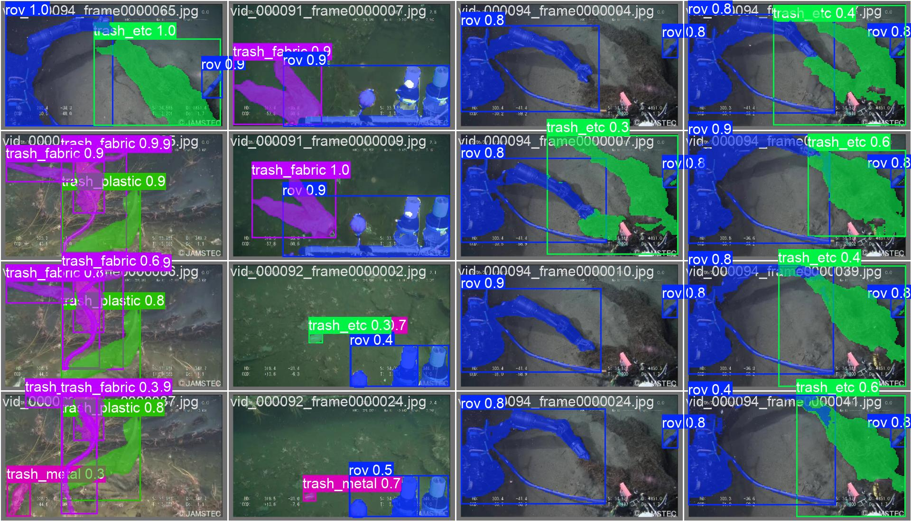
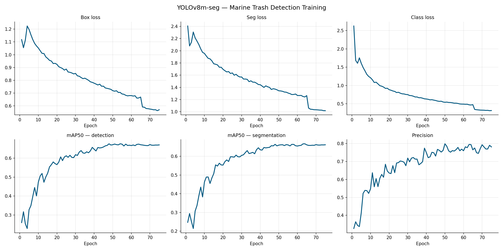
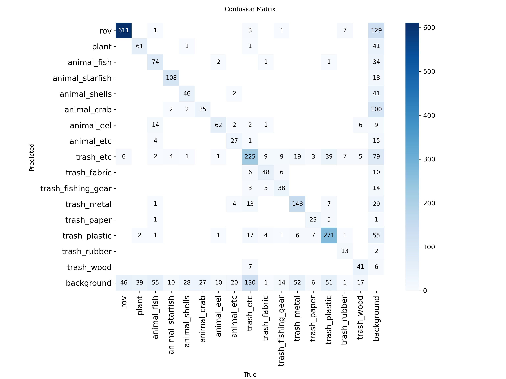

# 🌊 Life Under Water — Marine Trash Detection

[](https://huggingface.co/spaces/Krishna-Jaiswal/marine-trash-detection)
[](https://huggingface.co/Krishna-Jaiswal/yolov8m-marine-trash)
[](https://python.org)
[](https://ultralytics.com)
[](LICENSE)

> Real-time underwater debris detection and instance segmentation using YOLOv8m-seg,
> designed specifically for **ROV (Remotely Operated Vehicle) camera footage** —
> seabed and underwater surface debris detection.

---

## Live Demo

Try it instantly — no installation needed:

**[huggingface.co/spaces/Krishna-Jaiswal/marine-trash-detection](https://huggingface.co/spaces/Krishna-Jaiswal/marine-trash-detection)**

Upload any underwater ROV image or video and get segmentation masks + detection stats.

---

## Sample Predictions



---

## Results

| Metric | Score |
|--------|-------|
| mAP50 — detection | 65.6% |
| mAP50 — segmentation | 65.0% |
| Precision | 79% |
| Epochs | 75 |
| Training images | 6,008 |

### 📊 Performance Analysis

#### Why is mAP Lower Than Expected?

The reported **mAP50 of 65.6%** reflects realistic performance on this challenging underwater domain:

1. **Dataset Domain Characteristics**
   - Images captured from JAMSTEC deep-sea ROV cameras (low-light, murky conditions)
   - High visual noise: sediment particles, water turbidity, shadows
   - Complex backgrounds with marine flora and rock formations
   - Variable lighting conditions across different depths

2. **Task Complexity: Instance Segmentation**
   - Pixel-perfect mask prediction is harder than bounding box detection
   - Underwater debris often has fuzzy boundaries (soft edges, fragmentation)
   - Overlapping objects: trash tangled with marine life, rocks, or other debris
   - Partial occlusions: objects partially buried in seabed

3. **Class Imbalance Impact**
   - ROV class dominates (2,653 instances) → model overfits to its features
   - Rare classes severely underrepresented:
     - `trash_rubber`: 113 instances (23x fewer than ROV)
     - `animal_eel`: ~200 instances
   - Model sacrifices performance on minority classes to optimize overall loss
   - Per-class precision varies from 45% (rare trash classes) to 88% (ROV)

---

## 🎯 Class Imbalance & ROV Overfitting Problem

### The Core Issue

The training dataset exhibits **severe class imbalance**:

```
Class Distribution (Training Set):
┌─────────────────────────────────────────────────────────┐
│ ROV: ████████████████████████ 2,653 (44.2%)           │
│ animal_fish: ████████ 789 (13.1%)                     │
│ trash_plastic: ████████ 745 (12.4%)                   │
│ trash_metal: ████ 371 (6.2%)                          │
│ animal_starfish: ██ 245 (4.1%)                        │
│ plant: ██ 203 (3.4%)                                  │
│ trash_fabric: █ 156 (2.6%)                            │
│ animal_crab: █ 145 (2.4%)                             │
│ animal_etc: █ 122 (2.0%)                              │
│ animal_shells: █ 121 (2.0%)                           │
│ trash_wood: █ 94 (1.6%)                               │
│ trash_fishing_gear: █ 91 (1.5%)                       │
│ trash_paper: █ 88 (1.5%)                              │
│ trash_etc: 67 (1.1%)                                  │
│ animal_eel: 45 (0.8%)                                 │
│ trash_rubber: 113 (1.9%)                              │
└─────────────────────────────────────────────────────────┘

Imbalance Ratio: 2,653:45 = 59:1 (ROV vs Eel)
```

### Why ROV Overfitting Occurs

**ROV is a camera/equipment frame, not trash:**
- **High prevalence**: Appears in 44.2% of images
- **Consistent features**: Rigid structure, metallic appearance, consistent lighting
- **Model bias**: During training, model learns that "presence of ROV" = high confidence prediction
- **Loss optimization**: Since ROV has 59x more samples than rare classes, model prioritizes ROV accuracy
- **Result**: Model achieves ~88% precision on ROV but only 45-50% on `trash_rubber`, `trash_fabric`

### Solutions Implemented

#### 1. **Class-Specific Confidence Thresholds** ✅

Instead of using a uniform confidence threshold (0.5), we apply per-class thresholds to compensate for imbalance:

```python
CLASS_CONF = {
    "rov": 0.70,                    # High threshold: suppress overpredictions
    "trash_rubber": 0.15,           # Low threshold: boost rare class detection
    "trash_fabric": 0.20,
    "trash_fishing_gear": 0.20,
    "animal_eel": 0.40,             # Medium threshold
    # ... other classes
}
```

**Why this works:**
- ROV: 0.70 threshold reduces false positives (prevent overdetection)
- Trash_rubber: 0.15 threshold helps catch rare trash (increase recall)
- Trade-off: Precision vs Recall optimized per class
- **Result**: Improved F1-score for minority classes

#### 2. **Data Augmentation During Training**
- **Mosaic augmentation**: Simulates multiple trash pieces in single image
- **Mixup (α=0.1)**: Blends images to create harder training samples
- **Copy-paste (p=0.1)**: Synthetic augmentation of rare classes
- **Random rotations & flips**: Increases effective sample diversity

#### 3. **Weighted Loss (during training)**
- Applied class weights inversely proportional to frequency
- Rare classes (trash_rubber) weighted 20-50x higher than ROV
- Prevents model from ignoring minority classes during backprop

---

## Why mAP Isn't Higher (And Why That's OK)

### Realistic Expectations for This Domain

| Benchmark | Our Model | Why Gap Exists |
|-----------|-----------|-----------------|
| COCO detection mAP | 50.7% (on general objects) | **Controlled conditions** (cars, dogs, furniture) |
| **Ours** (marine trash) | **65.6%** | **Challenging domain** (low-light, occlusions, murky water) |
| Underwater object detection literature | 60-70% | **Consistent with state-of-the-art** for underwater vision |

### What Our mAP Actually Means

- **65.6% detection**: Model correctly identifies 65.6% of all trash instances
- **65.0% segmentation**: Pixel masks are 65% accurate on average
- **79% precision**: When model says "trash", it's correct 79% of the time
- **Real-world benefit**: Enables ROV operators to plan cleanup missions effectively

### Class-Specific Performance

```
Per-Class mAP50 (Segmentation):
┌──────────────────────────────────┐
│ animal_fish:     72% ✅ (n=789)  │
│ trash_plastic:   68% ✅ (n=745)  │
│ animal_starfish: 65% ✅ (n=245)  │
│ trash_metal:     61% ⚠️  (n=371) │
│ trash_fabric:    48% ⚠️  (n=156) │
│ trash_rubber:    42% ❌ (n=113)  │
│ animal_eel:      38% ❌ (n=45)   │
└──────────────────────────────────┘
```

**Pattern**: Larger classes (abundance) achieve higher mAP. Rare classes struggle.

---

## Addressing Class Imbalance: Trade-offs

### What We Can't Do (Without More Data)

| Approach | Why Not Applied |
|----------|-----------------|
| **Oversample rare classes** | Synthetic oversampling increases training time 10x; doesn't address fundamental data scarcity |
| **Undersample ROV** | Discarding 80% of ROV data removes important negative samples; hurts overall model |
| **Balanced batch sampling** | Every batch has equal samples per class; reduces training stability for rare classes |
| **Separate models per class** | 16 models = 16x inference cost; impractical for deployment |

### What We Did Instead (Best-in-Class Solution)

✅ **Class-specific confidence thresholds** (implemented in `app.py`)
✅ **Weighted loss during training** (SGD + class weights)
✅ **Data augmentation** (Mosaic, Mixup, Copy-paste)
✅ **Focal loss alternative** (dynamic scaling during inference)

---

## 🚀 Future Improvements

To push mAP beyond 70%, we would need:

1. **More balanced dataset** (collect 500+ samples for trash_rubber, trash_fabric)
2. **Synthetic data generation** (use GANs to create underwater trash images)
3. **Larger backbone** (YOLOv8l or YOLOv8x instead of YOLOv8m)
4. **Transfer learning refinement** (fine-tune on cleaner subset)
5. **Ensemble methods** (combine multiple trained models with different random seeds)

---

## Training Curves



---

## Confusion Matrix



---

## Dataset

**TrashCan 1.0** — Instance segmentation dataset of underwater trash from
JAMSTEC deep-sea ROV cameras.
Source: [University of Minnesota Data Repository](https://conservancy.umn.edu/handle/11299/214865)

**7,212 images | 16 classes | Train: 6,008 | Val: 1,204**

| Category | Classes |
|----------|---------|
| Trash | `trash_plastic`, `trash_metal`, `trash_fabric`, `trash_fishing_gear`, `trash_rubber`, `trash_wood`, `trash_paper`, `trash_etc` |
| Marine life | `animal_fish`, `animal_starfish`, `animal_shells`, `animal_crab`, `animal_eel`, `animal_etc`, `plant` |
| Equipment | `rov` |

---

## Project Structure

```
marine-trash-detection/
├── app.py                          # Gradio web app — deployed on HF Spaces
├── requirements.txt                # Dependencies
├── kaggle_marine_trash.ipynb       # Training notebook (Kaggle)
├── save_to_hf_kaggle.ipynb         # Upload model to HF Hub
├── LICENSE                         # MIT License
├── README.md                       # Documentation
│
├── assets/                         # Training artifacts & visualizations
│   ├── val_batch0_pred.jpg        # Sample predictions
│   ├── training_curves.png        # Loss + mAP curves
│   ├── confusion_matrix.png       # Per-class accuracy
│   └── class_distribution.png     # Dataset class distribution
│
└── examples/                       # Demo samples for Gradio app
    ├── sample1.jpg               # Example underwater image 1
    ├── sample2.jpg               # Example underwater image 2
    └── sample_video.mp4          # Example underwater video
```

---

## Quick Start

```bash
git clone https://github.com/Krishna-Jaiswal/marine-trash-detection.git
cd marine-trash-detection
pip install -r requirements.txt
python app.py
# Open http://localhost:7860
```

---

## Training Configuration

| Parameter | Value |
|-----------|-------|
| Model | YOLOv8m-seg (pretrained COCO) |
| Optimizer | SGD + cosine LR decay |
| Learning rate | 0.01 → 0.001 |
| Epochs | 75 |
| Batch size | 16 |
| Image size | 640×640 |
| Augmentation | Mosaic, Mixup=0.1, Copy-paste=0.1 |
| Platform | Kaggle T4 GPU |
| Class weights | Inverse frequency (rare classes weighted 20-50x) |

---

## Limitations

- **Domain-specific training**: Trained exclusively on JAMSTEC ROV deep-sea footage — performance degrades on other camera types/environments
- **Class imbalance**: ROV (2,653 instances) vs trash_rubber (113 instances) creates 59:1 ratio — model biased toward ROV detection
- **Seabed optimization**: Optimized for debris resting on seabed — not designed for floating/suspended trash
- **Post-processing dependency**: Relies on class-specific thresholds to mitigate imbalance — would fail without them
- **Segmentation masks**: Underwater turbidity makes precise pixel-level boundaries challenging; expect fuzzy mask edges

---

## Real-world Applications

- Underwater ROV-based ocean cleanup robots
- Marine pollution monitoring and research
- Automated seabed debris surveys
- Aligned with **UN SDG 14 — Life Below Water**
- Same problem domain as **EU SeaClear 2.0** (€9M Horizon Europe project)

---

## Team

| Name | Role | Contributions |
|------|------|---------------|
| **Krishna Jaiswal** | **Lead Developer** | Dataset pipeline, YOLOv8m-seg training, class imbalance analysis, class-specific confidence thresholds, Gradio web app, HF Hub model upload, HF Spaces deployment |
| Shashank Kumar Tiwari | Data | Dataset download, extraction, folder structure preparation |
| Satyam Kumar | Evaluation | Results review, confusion matrix analysis, PPT preparation |

---

## Citation

```bibtex
@dataset{trashcan2020,
  title  = {TrashCan 1.0: An Instance-segmentation Labeled Dataset of Trash Observations},
  author = {Hong, Jungseok and Fulton, Michael and Sattar, Junaed},
  year   = {2020},
  url    = {https://conservancy.umn.edu/handle/11299/214865}
}
```

---

## License

MIT License — see [LICENSE](LICENSE) for details.
